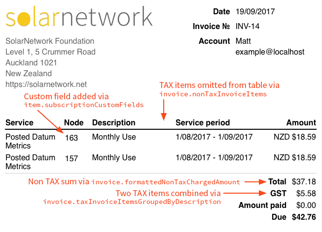

SolarNetwork Kill Bill Invoice Formatter
========================================

An extended version of the default Kill Bill invoice formatter, exposing some additional attributes
for invoice templates to work with.

For example, imagine an invoice with 2 taxable items and 2 tax items in it, like this:

| Item ID  | Type    | Description  | Amount |
| -------- | ------- |------------- | -----: |
| f6512175 | `USAGE` | Monthly Use  |  18.59 |
| a2ae679d | `USAGE` | Monthly Use  |  18.59 |
| 87afecdc | `TAX`   | GST          |   2.79 |
| d91a6f89 | `TAX`   | GST          |   2.79 |

The goal of the invoice is to list only non-`TAX` items in the main list, and then combine all `TAX`
items into a single value. The result looks like this:



The example also shows how custom fields attached to subscriptions can be included on the invoice.


Additional Template Attributes
------------------------------

This invoice formatter extends both the top-level `invoice` object passed to the template as well as
all the items returned from attributes like `invoice.invoiceItems`. The tables below outline just
the extended attributes added on top of the existing attributes provided by the built-in Kill Bill
classes.

### Invoice attributes

The following additional attributes are available on the `invoice` top-level template object:

| Attribute | Type | Description |
| --------- | ---- | ----------- |
| `basicFormattedBalance` | String | Formatted version of the built-in `balance` without an implicit currency symbol. |
| `basicFormattedPaidAmount` | String | Formatted version of the built-in `paidAmount` without an implicit currency symbol. |
| `customFields` | List of custom fields | All custom fields associated with the account owning the invoice. |
| `formattedNonTaxChargedAmount` | String | Formatted version of `nonTaxChargedAmount`. |
| `formattedTaxAmount` | String | Formatted version of `taxAmount`. |
| `nonTaxChargedAmount` | Number | Sum total of all `nonTaxInvoiceItems`. |
| `nonTaxInvoiceItems` | List of invoice items | Filtered copy of all invoice items _except_ `TAX` items. |
| `nonTaxInvoiceItemsSortedBySubscriptionCustomFields` | List of invoice items | Filtered copy of all invoice items _except_ `TAX` items, sorted by subscription custom field values and then item descriptions. |
| `taxAmount` | Number | Sum total of all `TAX` invoice items. |
| `taxInvoiceItems` | List of invoice items | Filtered copy of _only_ `TAX` invoice items. |
| `taxInvoiceItemsGroupedByDescription` | List of invoice items | The `taxInvoiceItems` list aggregated by item description. |

The two `basic*` attributes are there so the amounts are formatted consistently with invoice items.
The built-in equivalents format the amounts so even implicit currency symbols are included. For
example, if the invoice **currency** is `USD` and the **locale** is `en_US` then using the built-in
formatting for the amount `1.99` would result in `US$1.99` while the `basic*` equivalent would
produce `$1.99`.

The `taxInvoiceItemsGroupedByDescription` attribute is useful for combining similar tax invoice
items into a single item, based on their descriptions. For example, imagine an invoice with two tax
items, both with a description of `GST`, for the respective amounts `1.50` and `1.25`. The
`taxInvoiceItemsGroupedByDescription` attribute will return a list of a single `GST` item with an
amount of `2.75`.

The `nonTaxInvoiceItemsSortedBySubscriptionCustomFields` property provides a list of invoice items
sorted first by any subscription custom field _values_ followed by item descriptions. Looking back
at the screenshot shown earlier in this document, the **Node** column values are from a custom
field. In effect, this list will order invoice items for the same "node" next to one another.

### Invoice item attributes

The following additional attributes are available on each invoice item object returned by all
`invoice` attributes that return invoice items:

| Attribute | Type | Description |
| --------- | ---- | ----------- |
| `subscriptionCustomFields` | List of custom fields | All custom fields associated with this invoice item. |

### Custom field attributes

The following attributes are available on each custom field object:

| Attribute | Type | Description |
| --------- | ---- | ----------- |
| `fieldName` | String | The custom field name. |
| `fieldValue` | String | The custom field value. |
| `objectId` | UUID | The unique ID of the object the custom field is associated with. |
| `id` | UUID | The unique ID of the custom field. |
| `objectType` | Enum | The `org.killbill.billing.ObjectType` of the object the custom field is associated with. |


Kill Bill Compatibility
-----------------------

| Plugin version | Kill Bill version |
| -------------: | ----------------: |
| 0.x.y          | 0.18.z            |


Deployment
----------

The JAR must be included on the Kill Bill class path. This can be accomplished by
adding it to the `WEB-INF/lib` directory of the WAR.

Then, the following property must be updated in `killbill.properties`:

```
org.killbill.template.invoiceFormatterFactoryClass = net.solarnetwork.billing.killbill.invoice.SolarNetworkInvoiceFormatterFactory
```

Releases
--------

Releases can be executed like this:

```
./gradlew release --console plain
```
